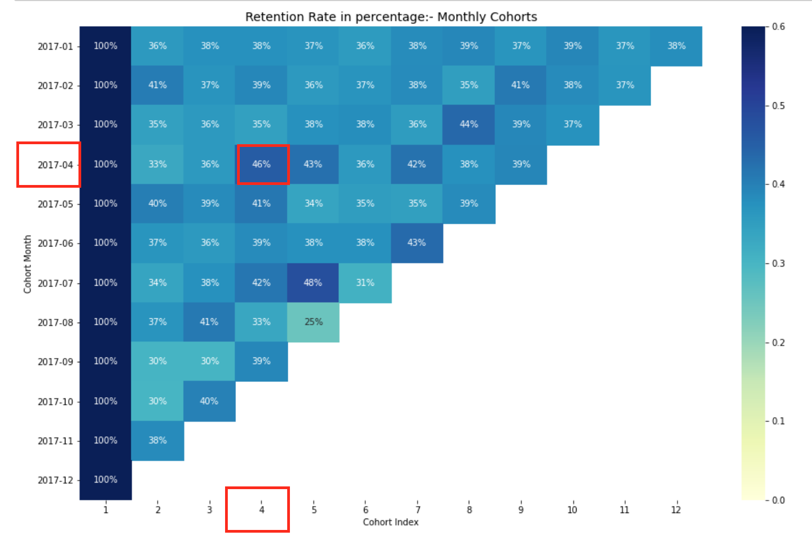

# cohort-retention-rate-analysis-in-python
Medium Size Bikes &amp; Cycling Accessories Organisation's Transactions Data Based Cohort Analysis¶

***

## Dataset: [Medium Size Bikes & Cycling Accessories Organisation's Transactions Data](https://www.kaggle.com/archit9406/customer-transaction-dataset)

***

## View the complete blog [here](#).

***

## After understanding and working with this notebook, you will be able to do:

* Understand what is cohort and cohort analysis
* Handling missing values
* Month extraction from date
* Assign cohort to each transaction
* Assigning cohort index to each transaction
* Calculate number of unique customers in each group
* Create cohort table for retention rate
* Visualize the cohort table using heatmap
* Interpreting the retention rate
* Work with other business matrices

***

# Cohort Analysis Basics
Understanding the retention rate for the medium size bikes & cycling accessories organisation.

A descriptive analytics technique is cohort analysis. Customers are divided into mutually exclusive cohorts, which are then tracked over time. Vanity indicators don't offer the same level of perspective as cohort research. It aids in the deeper interpretation of high-level patterns by supplying metrics around the product and consumer lifecycle.

**Generally there are three majot types of Cohort:**

Time cohorts : customers who signed up for a product or service during a particular time frame.
Behavior cohorts : customers who purchased a product or subscribed to a service in the past.
Size cohorts : refer to the various sizes of customers who purchase company’s products or services.
However, we will be performing Cohort Analysis based on Time. Customers will be divided into acquisition cohorts depending on the month of their first purchase. The cohort index would then be assigned to each of the customer's purchases, which will represent the number of months since the first transaction.

Here, we will be dealing with mainly on monthly basis for

* transaction_date
* customer_id
* standard_cost
* list_price

***

> Thanks!
